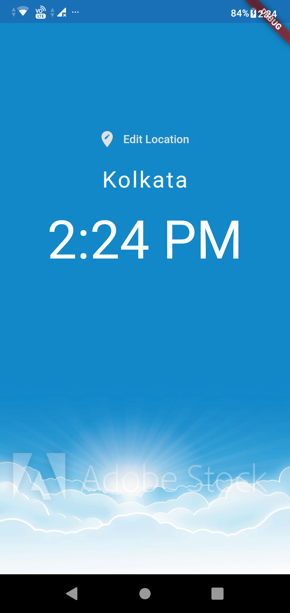
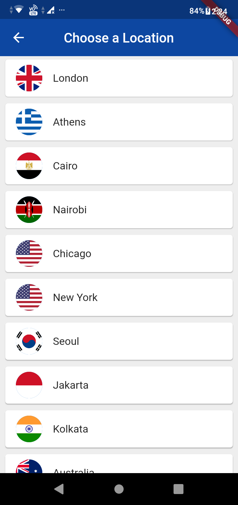
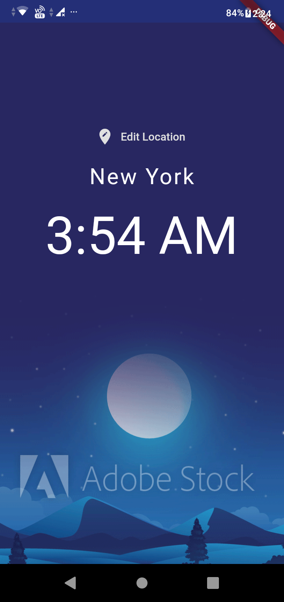
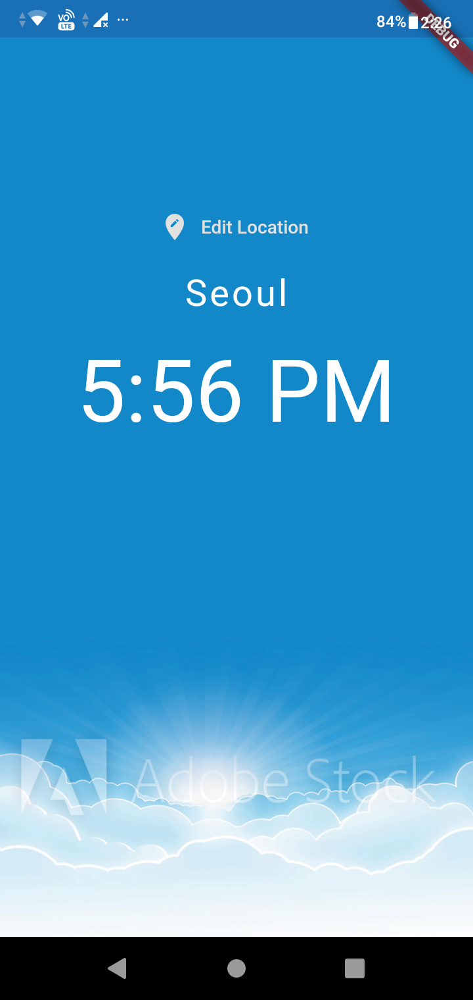
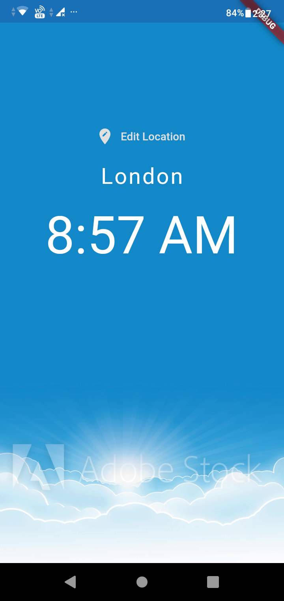

# World Time Application
Flutter application which shows time of any location across the globe in real time

### Initially a loading screen will appear, till the time the application fetches the data from the API.

### Then it shows the location and the time in 12 hr format. The background changes according to the time of the location.

### On clicking the Edit Location, we can choose the location from the locations shown in the pop up screen.

### Time with the chosen location is shown in the screen. Also the background image adjusts whether it is day or night in the location.

&nbsp;&nbsp;&nbsp;&nbsp;&nbsp;&nbsp;
